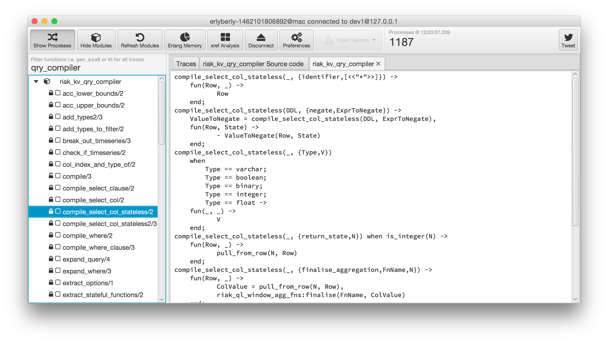
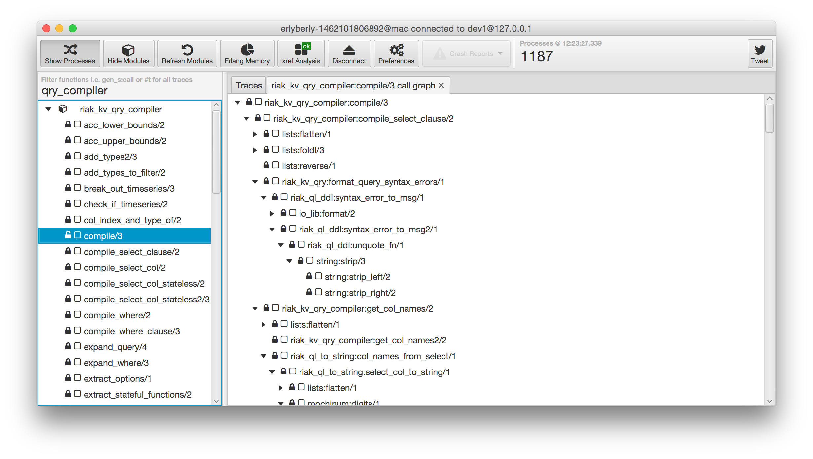

# erlyberly

**I'll be speaking about tracing and erlyberly at the Glasgow Elixir group on the 25th of April, hope to see you there! Event information [here](https://www.eventbrite.co.uk/e/glasgow-elixir-elixirerlanglfebeam-and-fp-meetup-registration-24351179032?).**

[](https://travis-ci.org/andytill/erlyberly)

**erlyberly** is a debugger for erlang, [elixir](https://twitter.com/andy_till/status/539566833515626497) and LFE using erlang tracing. It is probably the easiest and quickest way to start debugging your nodes.

If you are using `io:format/2` or lager for debugging then erlyberly can save you time.  Tracing requires no code changes and no recompliation to see function calls and results. **erlyberly** makes debugging smoother by reapplying traces when modules are reloaded and when the node restarts.

### Quick start

A one liner to go from zero to erlyberly user.  You will need **JDK 8u20** or higher installed to run erlyberly, download it [here](http://www.oracle.com/technetwork/java/javase/downloads/jdk8-downloads-2133151.html).

```
git clone git@github.com:andytill/erlyberly.git && cd erlyberly && ./mvnw clean compile install assembly:single && java -jar target/*runnable.jar
```

### Compiling

Tags will no longer have binary releases, compile from master to get the latest features and bug fixes. This is easy with the one step build.  You will need **JDK 8u20** or higher installed to run erlyberly, download it [here](http://www.oracle.com/technetwork/java/javase/downloads/jdk8-downloads-2133151.html).

Now, git clone the repo:

    git clone https://github.com/andytill/erlyberly.git

`cd` into the erlyberly repo directory and run:

    ./mvnw clean compile install assembly:single

This will install dependencies locally and build the runnable jar, run erlyberly:

    java -jar target/erlyberly-<version>-runnable.jar

Make sure to run the jar marked runnable, this has all it's dependencies included to make it portable.  Otherwise `ClassNotFoundException` will be thrown. If the jar wasn't compiled from a tag it will have SNAPSHOT in the jar name.

### Compiling for dev work

To recompile erlyberly.erl or java source after modifications but not recreate the jar:

    ./mvnw compile

Note usage of `./mvnw`. erlyberly uses [maven-wrapper](https://github.com/takari/maven-wrapper) so that maven does not need to be installed to compile.

### Features and How To

##### Set traces on functions

All the modules loaded by the VM appear in the module tree.  Expand one of modules to view the functions, double clicking the star toggles tracing on and off.  Any calls made to that function by any process will now be shown in the right hand list.  Press `ctrl+t` while a function is selected to toggle a trace without touching your mouse.


Right click on a module and then click **Module Trace** to put a trace on all functions displayed under the module. If some functions are not displayed because of a filter, the trace will not be applied.

##### See calls to functions and their results

Double click on a trace to see a breakdown of the arguments and results of the function call.


##### See calls that threw exceptions

Exceptions are highlighted.


##### See incomplete calls

A call that hasn't returned yet is highlighted in yellow.

##### Sequential Tracing of messages

Sequential Tracing ([seq_trace](http://www.erlang.org/doc/man/seq_trace.html)) is message tracing from process to process, allowing you to see the message flow through the application.


To start a seq trace right click on a function and select **Seq Trace (experimental)**, a Window will pop up that will display the trace messages.  When the traced function is called, messages sent afterwards are shown in the window.

This functionality is experimental and highly likely to bork the remote node under test and erlyberly.  Once a seq trace is set the only way to stop it is to terminate erlyberly or run `seq_trace:reset_trace()` in the shell of the remote node.

##### Get the process state

Get and display the state of a process. 


This uses [sys:get_state/1](http://www.erlang.org/doc/man/sys.html#get_state-1) under the hood and so has the same limitations. Processes that do not support the system message may not respond.

If the value is a record that is compiled into the module of the processes initial call then the record name and field names will appear highlighted. Records that are not known by the module at compile time will not be highlighted.

##### Attach to any running system

erlyberly connects as an erlang node to the node you want to trace. Once connected it can trace your application code, 3rd party modules and modules that are part of the erlang standard libary.

Just make sure that the `runtime_tools` application is available in the code path.  If the node was run using erl directly then it will be available by default.

erlyberly is not meant to trace production systems.  There is no overload protection as per redbug.

##### Filtering

Easily find what you're looking for by using the filter fields.

|        Filter       |                             What is searched?                             |
| ------------------- | :-----------------------------------------------------------------------: |
| processes           |                          pid and registered name                          |
| modules & functions | modules, functions can be filtered using a colon i.e. `my_module:my_func` |
| trace logs          |                        All text shown in the trace                        |

The process and trace filters support **or** and **not** filters, module filtering does not support this.  By entering `!io` in the trace filter, all traces containing the text `io` will be hidden, by entering `lists|proplists` only traces containing the text `lists` or `proplists` will be shown.

If the filter is empty then all data is shown.

Show functions that are currently traced by setting `#t` as the function filter.

##### Trace between restarts

When the target node VM gets restarted, erlyberly tries to reconnect and reapply the traces you had previously set.  This is great for your dev workflow.  Make a change, restart and your traces will be there waiting for you to retest.

If you hotload code during development either manually or using a reloader like [sync](https://github.com/rustyio/sync) then you may notice that reloading a module removes all traces on it.  erlyberly listens for modules being reloaded and reapplies any traces that were previously applied to it, without interrupting you!

##### See graphs for process memory usage

Open up the process table, next to the memory usage columns there is a pie chart icon.  Clicking one of these icons shows the memory usage of all the processes that were selected in the table.


##### View the source code for modules and functions

View the source code for a module by right clicking on a module and selecting `View Source Code`. If a function is selected then only source for that function will be shown.



The source code that is shown by erlyberly is decompiled from the beam file, not what was actually compiled so comments and code that was excluded with an `ifdef` will be ommitted.

##### View the abstract source code for modules and functions

View the abstract source code for a module by right clicking on a module or function and selecting `View Abstract Code`. The beam file for the module must exist and it must have been compiled with `+debug_info` or the source code will not 


Abstract code is an erlang term representation of a beam file. You can use it to see how a module is compiled. One use case is to make sure that variables that you think will made constants in the beam code do actually get compiled that way.

##### View the call graph for a function

See what functions another function calls by right clicking on it and clicking `View Call Graph`.  This is helpful to understand dependencies of functions.



The `View Call Graph` option is disabled until the you have clicked the `xref Analysis' button at the top of the window and it shows **ok** in green. This is because xref must analyse all of the modules loaded by the VM which can take a while. You may see xref output in the console while xref performs analysis.

Traces can be applied to all functions in a call graph by right clicking and selecting `Recursive Trace`.  Traces will be applied recursively to all functions by the selected function in the graph.  This can be used to find a function that is throwing an exception when a stack trace is not  available. The function throwing the exception will appear in the trace list in red.

##### Get notified of crash reports

When an OTP process dies it generates a crash report which is typically logged to a file by lager or sasl. Erlyberly acts as another crash report handler and displays the number in red  of crash reports next to the `Crash Report` button.


Click the button to view the crash reports and clear the notifications displayed in the button.  Double click on them to view in more detail.

##### Cross platform

Tested on OSX, Linux Ubuntu, RHEL and CentOS and Windows 7/8.

### Shortcuts

On OSX all shortcuts use `cmd` instead of `ctrl`.

|      Keys      |                                           Action                                           |
| -------------- | :----------------------------------------------------------------------------------------: |
| `escape`       |                                     Close sub windows.                                     |
| `ctrl+f`       |       Focus on the last focused filter field, or the next if one is already focused.       |
| `ctrl+m`       |                        Toggle visibility of modules and functions.                         |
| `ctrl+n`       |                                     Clear trace logs                                       |
| `ctrl+p`       |                              Toggle visibility of processes.                               |
| `ctrl+t`       |                Toggle tracing for the selected function in the module tree.                |
| `ctrl+shift+t` | Press in the module/function filter field to apply traces to all functions that have not been filtered. |

### Trouble Shooting


##### Cannot connect or Name server errors on connection
erlyberly must have epmd running on the machine as it is running.  Otherwise it will not be able to connect to the remote node with an error about Name Servers.  The easiest way to run epmd is to run the following command in the shell `erl -sname hi`, this requires erlang to be installed and on the `PATH`.

##### Cannot start, `NoSuchMethodException` is thrown
This happens when java version 8 is installed but the update is less than 20. Please update your version of java. See issue [#39](https://github.com/andytill/erlyberly/issues/39).

### Creating a tag

If you have admin rights on the repo:

	git release:prepare

The tag name should be the tag version. The new development tag should be an incremented version prepended with `-SNAPSHOT`.

### Roadmap

Some things that are important.

1. Bug fixing and stability for current features is number one priority right now. Help by contributing issue reports.
2. Improved elixir support.
3. Better seq_trace support.
4. Beat CAP.

erlyberly is meant to be a complementary to observer so there will be no attempt to implement features such as the supervisor hierarchy graph.

### Special Thanks

The following people have contributed code to erlyberly:

+ [@aboroska](https://github.com/aboroska)
+ [@ruanpienaar](https://github.com/ruanpienaar)
+ [@horvand ](https://github.com/horvand)

The hex editor originated from [hexstar](https://github.com/Velocity-/Hexstar).
