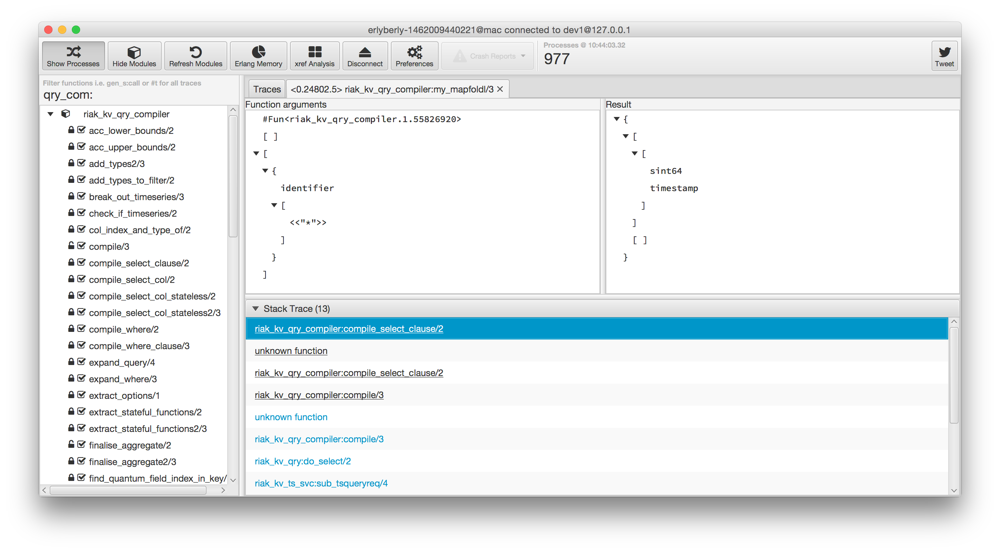

# erlyberly

erlyberly is a debugger for erlang, and elixir. It captures calls to functions, without blocking your processes.

If you're using `io:format/2` or lager for debugging then erlyberly can save you time.  There is no recompliation and no log statements need to be removed (or not!) afterwards.

### Features

##### See calls to functions and their results

View a breakdown of the aguments and results (if the function has finished) of a trace by double clicking on it.

##### See calls that threw exceptions

Exceptions are highlighted.

##### Grep trace logs

Easily find values that you're looking for by using the trace search.  It allows filtering for and excluding items using a text search.

##### Attach to any running system

Just make sure that the `runtime_tools` application is available in the code path.  If the node was run using erl then it will be available.  If it was packaged by rebar or relx and run from a boot script you may need to add the dependency to the release configuration.

**erlyberly is not meant to trace on production systems.  There is no overload protection as per redbug.**

##### Cross Platform

Tested on Ubuntu and Windows 7/8.

### How to get it

Go to the github [releases section](https://github.com/andytill/erlyberly/releases) and download the runnable jar.  In Windows you can double click to run it or from the console in any OS `java -jar erlyberly-runnable.jar`.

You will need Java 8 run erlyberly, download it [here](http://www.oracle.com/technetwork/java/javase/downloads/jdk8-downloads-2133151.html).  There are no other dependencies.

**If you are having issues try compiling the erlyberly beam against the erlang/OTP version it is being run against and building the jar again, instructions below.**

### Shortcuts

|   Keys   |                    Action                   |
| -------- | :-----------------------------------------: |
| `ctrl+p` |       Toggle visibility of processes.       |
| `ctrl+m` | Toggle visibility of modules and functions. |

### Compiling

You will need JDK 8 and Maven to compile.  erlyberly loads an erlang module to the remote node and then uses RPC to run traces and collect stats.  For convenience I have bundled the beam code in the source as well as the original erlang source.  If you want to recompile the beam code for yourself run the following command from the project directory:

    erlc -o src/main/resources/erlyberly/beam/ src/main/resources/erlyberly/beam/erlyberly.erl

To build the jar:

    mvn clean install assembly:single

This creates a runnable jar in the target directory.  Either double click it if your OS supports that or run a terminal:

    java -jar erlyberly-n.n.n-jar-with-dependencies.jar

You'll also need the [floaty-field](https://github.com/andytill/floaty-field) library installed in your local Maven cache.

### Roadmap

Some things that are important.

1. Bug fixing and stability for current features is number one priority right now.  Help by sending contributing issue reports.
2. seq_trace visualisation with graphs.
3. More statistics on the running system, such as memory and CPU.
4. Beat CAP.

erlyberly is meant to be a complementary to observer so there will be no attempt to implement features such as the supervisor hierarchy graph.